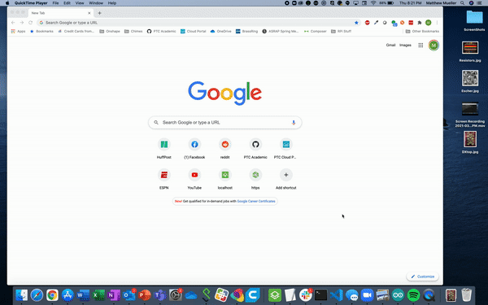
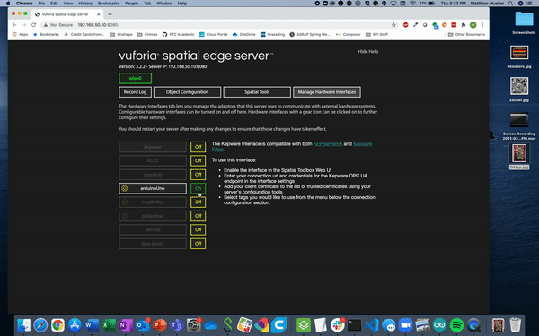

# SpatialToolbox on RaspberryPi with a WiFi Hotspot

This repo contains notes and instructions for configuring a WIFI-enabled Raspberry Pi (RPi) to act as a standalone WIFI hotspot and a [node.js](https://nodejs.org/) server running [Vuforia Spatial Toolbox](https://spatialtoolbox.vuforia.com/) (VST) Edge server. 

The purpose of this is to enable use of Vuforia Spatial Toolbox (VST) without the need for coding or connection to an existing WIFI network for less-technical audiences.

Summary:
- Installing VST on the RPi
- Setting up the RPi as a Wifi Hotspot
- Using the VST on the RPi Hotspot 

## Setting up the RPi

During the setup, it will be helpful to have a keyboard, mouse and monitor connected to the RPi, and have it connected via the ethernet port to an internet-connected router assigning addresses to the RPi. Alternatively, you can enable SSH on the RPi and do the setup from a command line interace on a computer connected to the same network that the RPi's ethernet port is connected to.

### Create an RPI image:
Download and install the [Raspberry Pi Imager](https://www.raspberrypi.org/software/), or use [another method](https://www.raspberrypi.org/documentation/installation/installing-images/README.md) to flash an image of Raspberry Pi OS to an SD card (must be a version with a desktop setup). If you do not have a keyboard, mouse and monitor, make sure you [enable SSH](https://www.raspberrypi.org/documentation/remote-access/ssh/) to be able to be able to access it.

- (Successfully tested using Debian with Desktop, release 2021-01-11)

## Install Vuforia Spatial Toolbox on the RPi

See below for two different options on how to install VST on your RPi.

<b>Install Yourself</b>

 
  
If you have experience with installing software from the command line, we'd recommend downloading and installing VST on your RPi following [these instructions](https://spatialtoolbox.vuforia.com/docs/vuforia-spatial-edge-server/raspberry-pi). Once installed, you can add any hardware interfaces that you'd like to work with, like the [basic interfaces adddons](https://spatialtoolbox.vuforia.com/docs/vuforia-spatial-basic-interfaces-addon) or the [robotics addons](https://spatialtoolbox.vuforia.com/docs/vuforia-spatial-robotic-addon). **Note:** in order to use the RPi hotspot without an ethernet connection to the internt, you will not be able to use interfaces that communicate with the internet.

<b>Install Basic Interfaces with Bash Script (includes Arduino addon)</b>

 

If you would like to automate the install process you can use the file called "RPiToolboxInstall.sh" attached to the top of this repo. In order to get the file on the RPi, you can either run

    wget https://raw.githubusercontent.com/PTC-Academic/RaspberryPi-SpatialToolbox-WifiHotspot/main/RPiToolboxInstall.sh

or you can download the file to your computer and copy it to the RPi over ssh with the following command, where the first argument is the file path to RPiToolbox.sh on your computer, and the second argument is pi@IPaddress

    scp /Users/Matthew/Downloads/RPiToolboxInstall.sh pi@192.168.1.174:~

Once the file is copied to your RPi, you can run the file with

    sudo bash RPiToolboxInstall.sh
    
If you'd like to change or add anything to the edge server, you need to run the following command from within the /vuforia-spacial-edge-server folder

    sudo chown -R $USER /home/pi

## Set up the RPi as a Routed Wifi Hotspot

See below for two different options on how to turn your RPi into a Wifi hotspot. For the "Bash Script" method, the WiFi network is named "RPiSpatialToolbox" with the password "Vuforia123".

<b>Automatically set up the Hotspot with a Bash Script</b>

 

The simplest way to set up the hotspot is to use the file named "RPiHotspotSetup.sh" linked in this repo. In order to get the file on the RPi, you can either run

    wget https://raw.githubusercontent.com/PTC-Academic/RaspberryPi-SpatialToolbox-WifiHotspot/main/RPiHotspotSetup.sh

or you can download the file to your computer and copy it to the RPi over ssh with the following command, where the first argument is the file path to RPiHotspotSetup.sh on your computer, and the second argument is pi@IPaddress

    scp /Users/Matthew/Downloads/RPiHotspotSetup.sh pi@192.168.1.174:~

Once the file is copied to your RPi, you can run the file with

    sudo bash RPiHotspotSetup.sh

Once set up, you can connect your devices to the WiFi network named "RPiSpatialToolbox" with the password "Vuforia123".

<b>Set up the Hotspot Yourself</b>

 
  
[This tutorial](https://www.raspberryconnect.com/projects/65-raspberrypi-hotspot-accesspoints/168-raspberry-pi-hotspot-access-point-dhcpcd-method) explains the process well. Follow the steps to include internet routing, which allows any device connected to the RPi's LAN through the hotspot to access the internet through the ethernet connection. **Note:** if you are using the VST without the ethernet connection, you will need to add one line to the dnsmasq.conf file (see the last step of these instrucitons for more info).
  

#### Methods used in this setup/tutorial:
- [Hostapd](https://en.wikipedia.org/wiki/Hostapd) enables the wifi card on the RPI to act as a hotspot (access point and WIFI authentication server), allowing users to connect to the RPi
- [DNSmasq](https://en.wikipedia.org/wiki/Dnsmasq) provides DNS services, handling the internet traffic on the hotspot network, serving domain names on the local network 
- [dhcpcd](https://wiki.archlinux.org/index.php/Dhcpcd) is a DHCP client. It assigns IP/Gateway/DNS addresses to network clients and store assigned addressesto avoid conflicts
- [ip forwarding](https://openvpn.net/faq/what-is-and-how-do-i-enable-ip-forwarding-on-linux/) enables the Pi to also connect to the internet, and allows some traffic to bypass the hotspot and go out. this may be turned on or off as explained below
- [ip tables](http://www.intellamech.com/RaspberryPi-projects/rpi_iptables.html) are used with ip forwarding to allow devices connected to the hotspot to access the internet

## **Optional:** Enable Auto Start of Node Server with PM2
If you would like to have the node server automatically start when the RPi boots up, you can use [a package called "Pm2"](https://pm2.keymetrics.io/docs/usage/startup/). **Note:** you might have to re-set up the pm2 service if you make any changes to VST install.

<b>DIY</b>

 
You can set this up with the following series of commands.

    sudo npm install -g pm2
    sudo env PATH=$PATH:/usr/bin /usr/lib/node_modules/pm2/bin/pm2 startup systemd -u pi --hp /home/pi
    pm2 start home/pi/vuforia-spatial-edge-server/server.js
    pm2 save

<b>Bash Script</b>

 
You can also download and run the bash file linked here called "RPiAutoStartServerPM2.sh".

    wget https://raw.githubusercontent.com/PTC-Academic/RaspberryPi-SpatialToolbox-WifiHotspot/main/RPiAutoStartServerPM2.sh

And run it with

    sudo bash RPiAutoStartServerPM2.sh

## Changes for Internet-free enviroments
If the Ethernet cable is unplugged or internet access is unavailable, the Spatial Toolbox Edge Server will fail. To resolve this, a change is made in the  *dnsmasq* seeting to route all traffic to the local DNS server, ignoring ip forwarding rules.

<b>To enable this (i.e. use without Ethernet cable)</b>

 
To edit the  *dnsmasq* seetings, run

    sudo nano /etc/dnsmasq.conf

Scroll all the way to the bottom of the text file, and add the following line of text

    address=/#/192.168.50.10

Then click ^x to exit the editor, and answer "Y" to save changes, then enter to exit.

<b>To disable this (i.e. you plugged the Ethernet cable back in and want to access the inernet)</b>

 
Once again, to edit the  *dnsmasq* seetings, run

    sudo nano /etc/dnsmasq.conf

Scroll all the way to the bottom of the text file, and **remove** the following line of text

    address=/#/192.168.50.10

so that the last line of the file is

    dhcp-range=192.168.50.150,192.168.50.200,255.255.255.0,12h

Then click ^x to exit the editor, and answer "Y" to save changes, then enter to exit.

[More information and discussion of alternative methods](https://raspberrypi.stackexchange.com/questions/93883/client-connects-to-node-web-server-once-connected-to-raspberry-pi-access-point) 

## Using the VST on the RPi Hotspot 
To install/run:
-	Plug in the RPi
-	Connect to its Wifi hotspot: RPiSpatialToolbox (or whatever you named your hotspot)
-	On your computer, go to the url "192.168.50.10:8080" to access the web interface of the VST and set up your hardware interfaces and objects
-	If you want to start/stop the VST yourself, you need to go into the "vuforia-spatial-edge-server" folder, and type "node server" to start or "^c" to stop
-	Start the Spatial Toolbox phone app; it may be neccessary to set the discovery server to 192.168.50.10:8080

Please refer to the [Vuforia Spatial Toolbox website](https://spatialtoolbox.vuforia.com/docs/use) for more information on how to use the VST.

